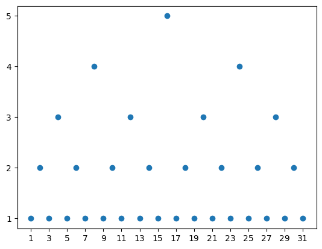
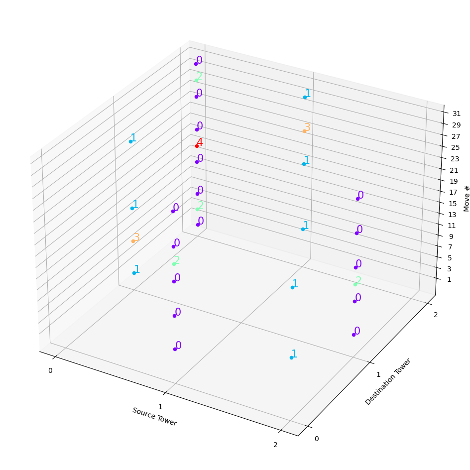

```python
import matplotlib.pyplot as plt
import numpy as np
```


```python
def towerOfHanoi(n):
    tower = [[i for i in reversed(range(n))], [], []]
    whichDiskMoved = [-1 for _ in range(2**n-1)]
    whatMoveWasMade = [-1 for _ in range(2**n-1)]
    move = -1
    def solve(n, source, middle, destination):
        if n <= 0:
            return
        sourceTower = tower[source]
        destinationTower = tower[destination]
        solve(n-1,source,destination,middle)
        destinationTower.append(sourceTower.pop())
        nonlocal move
        move+=1
        whichDiskMoved[move] = destinationTower[-1]
        whatMoveWasMade[move] = [whichDiskMoved[move],source,destination]
        solve(n-1,middle,source,destination)
    solve(n,0,1,2)
    return (whichDiskMoved, whatMoveWasMade)
n = 5
whichDiskMoved,whatMoveWasMade = towerOfHanoi(n)
```


```python
plt.scatter([i+1 for i in range(len(whichDiskMoved))], [d+1 for d in whichDiskMoved])
plt.xticks(np.arange(1, len(whichDiskMoved)+1, 2.0))
plt.yticks(np.arange(1, n+1, 1.0))
plt.show()
```


    

    


```python
fig = plt.figure(figsize=(12,12))
ax = fig.add_subplot(projection='3d')
colors = {disk:color for disk,color in zip(range(n),iter(plt.cm.rainbow(np.linspace(0, 1, n))))}
for idx,triplet in enumerate(whatMoveWasMade):
    disk,source,dest = triplet
    color = colors[disk]
    ax.scatter(source,dest,idx,color=color)
    ax.text(source,dest,idx,  '%s' % (str(disk)), size=15, zorder=1, color=color)
ax.set_xlabel('Source Tower')
ax.set_xticks(np.arange(0, 3, 1.0))
ax.set_ylabel('Destination Tower')
ax.set_yticks(np.arange(0, 3, 1.0))
ax.set_zlabel('Move #')
ax.set_zticks(np.arange(1, len(whichDiskMoved)+1, 2.0))
plt.show()
```


    

    

